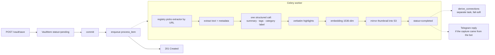
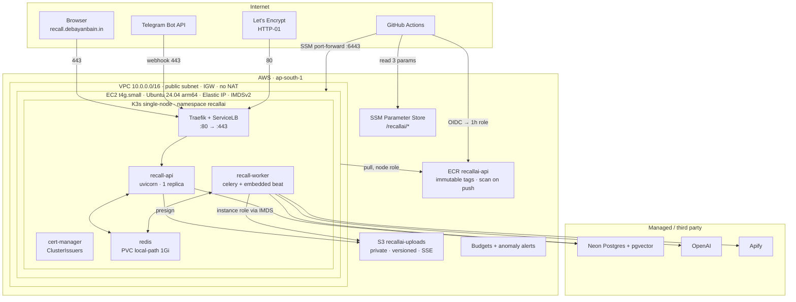
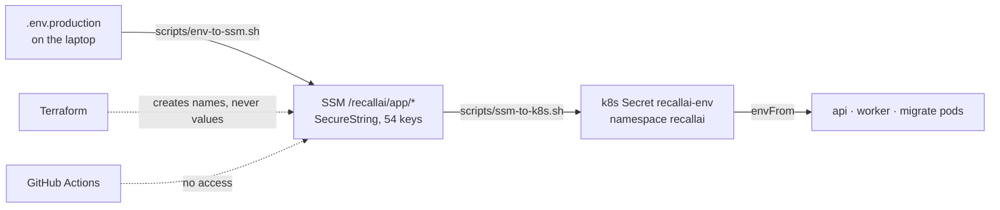
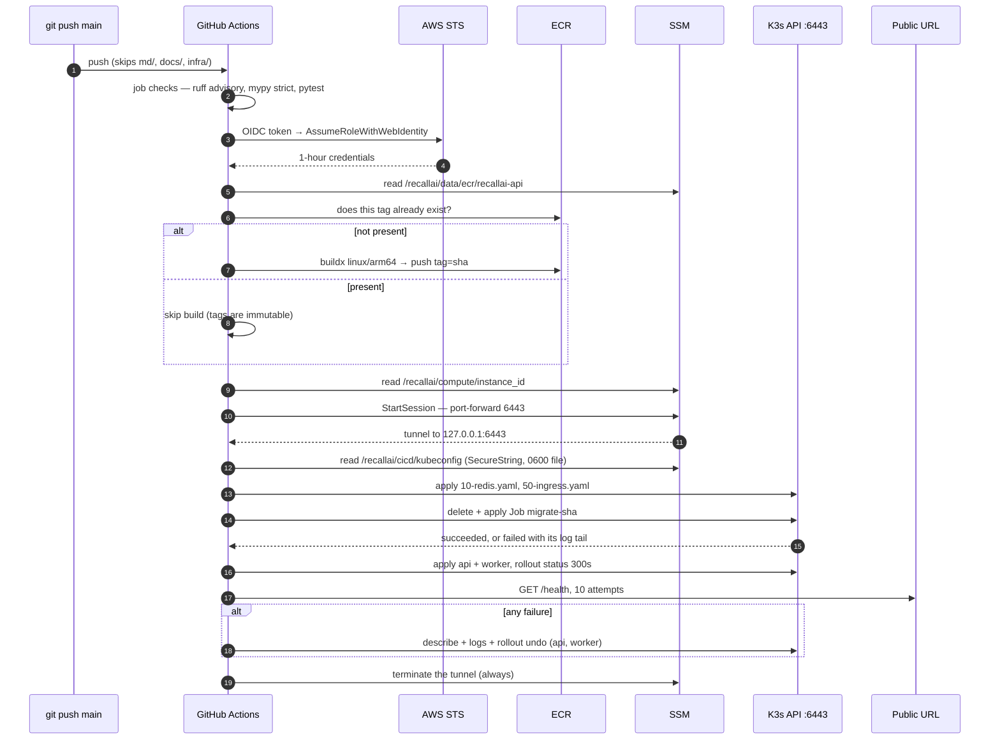

# RecallAI — backend

An AI memory vault. You send it a link, a file, a voice note or a thought — from the web
app or from Telegram — and it extracts the content, summarises it, tags it, labels it,
embeds it, files it, and proposes connections to what you already saved. Then you can ask
it questions in plain language, in any script, and it answers **only** from your own
memories, with citations that are checked before you see them.

- **Live API:** `https://recall-api.debayanbain.in` · **Frontend:** `https://recall.debayanbain.in`
- **Bot:** `@RecallAI_debayan_bot` (Telegram)
- **Runs on:** one `t4g.small` EC2 instance in `ap-south-1`, K3s, deployed by `git push origin main`
- **Scale of the code:** 163 Python modules / ~30k lines in `app/`, 96 test files / ~22.6k lines in `tests/`, 17 Alembic revisions

Two documents sit beside this one and go deeper than it does:
[`CLAUDE.md`](CLAUDE.md) is the engineering rulebook — every invariant and the failure that
paid for it. [`infra/40-cicd/README.md`](infra/40-cicd/README.md) is the deploy identity in
detail.

---

## Contents

1. [Highlights for a reviewer](#1-highlights-for-a-reviewer)
2. [Application architecture](#2-application-architecture)
3. [Production architecture on AWS](#3-production-architecture-on-aws)
4. [The deployment pipeline](#4-the-deployment-pipeline)
5. [Zero to deployed: the runbook](#5-zero-to-deployed-the-runbook)
6. [Day-2 operations](#6-day-2-operations)
7. [Cost model](#7-cost-model)
8. [Local development](#8-local-development)
9. [Quality gates](#9-quality-gates)
10. [API surface](#10-api-surface)
11. [Trade-offs and known gaps](#11-trade-offs-and-known-gaps)
12. [Verify every claim in five minutes](#12-verify-every-claim-in-five-minutes)

---

## 1. Highlights for a reviewer

| Claim | Where it is true in this repo |
|---|---|
| **No long-lived AWS credential exists anywhere** — not in GitHub, not in the cluster, not in a pod | GitHub Actions trades an OIDC token for a 1-hour role (`infra/40-cicd/`); the node reads S3 through its instance profile over IMDSv2 (`infra/30-compute/iam.tf`); the app's `.env` holds no AWS keys |
| **The Kubernetes API is not on the internet** | Ports 22 and 6443 are closed on the security group; CI reaches `kubectl` through an SSM port-forward scoped to one instance and one SSM document (`infra/10-network/security.tf`, `.github/workflows/deploy.yml`) |
| **CI can deploy and cannot read application secrets** | Namespaced ServiceAccount with no `secrets` verbs and no `delete` on Deployments (`k8s/70-deploy-rbac.yaml`); the IAM policy names three SSM parameters and excludes `/recallai/app/*` (`infra/40-cicd/iam.tf`) |
| **Terraform state is split by blast radius, not by folder taste** | Five root modules, five state files; `terraform destroy` in one is physically unable to reach the live node, and `prevent_destroy` guards the instance and the uploads bucket |
| **Migrations run as a gated step, not on app boot** | A Kubernetes `Job` named after the image tag, waited on, logs surfaced, failure stops the rollout (`k8s/20-migrate-job.yaml`) |
| **Rollback is a first-class path** | ECR tags are immutable and every image is its commit SHA, so `make deploy tag=<sha>` re-rolls an existing image; a failed deploy runs `rollout undo` for both Deployments |
| **Latency was engineered against measurement, not vibes** | The unit of optimisation is *statements per request*, because the database is a region away at ~290ms per round trip — `GET /vault` is one statement including its `total` (`count(*) OVER ()`), listings load card columns only with `raiseload=True` so a widened schema fails a test instead of emitting N+1 |
| **The AI surface is treated as an untrusted input path** | Retrieved memories are fenced as quoted data; the agent may *propose* a write but never perform one; every citation and URL in an answer is validated against what was actually surfaced, streaming included |
| **Failure modes are designed, not discovered** | `noeviction` on the broker so a lost capture becomes a producer error instead of silence; a beat sweeper re-queues anything stranded; a deferred-extraction correlation row survives a lost webhook |

What this is **not**: it is not multi-AZ, it is not multi-replica, and it does not pretend
to be. [Section 11](#11-trade-offs-and-known-gaps) states the gaps plainly.

---

## 2. Application architecture

### 2.1 One table, one pipeline

Everything saved is one **`VaultItem`** row discriminated by a `type` enum. There are no
per-platform tables: adding a source means adding an extractor, never a table or a route.

Saving never blocks on AI:



**Commit before enqueue** is load-bearing: the worker runs in its own transaction, so
enqueuing first lets a fast worker dequeue a row that is not visible yet, log
`process_missing_item`, and leave the capture at `pending` forever.

**Long extractions are fire-and-forget.** An Apify crawl can run for minutes, so
`ProcessingService` is two-phase: it starts the run, writes an `extraction_runs`
correlation row, and returns — the worker is free while the provider works. Apify POSTs
`/webhooks/apify/{secret}`, which queues finalisation; the callback body is treated as a
*signal*, never as data, and the real status and dataset are re-read from Apify with our
own token. A beat task sweeps runs that never called back, so a lost webhook degrades to
a delay rather than an item stuck in `processing` forever.

### 2.2 Layering

Strict and dependency-inverted: `api → services → repositories → models`.

```
app/
  api/            FastAPI routers (thin) — HTTP ↔ schemas, all wiring via api/deps.py
  services/       use-cases; no SQL, no HTTP objects
  repositories/   every query; sessions arrive by constructor
  models/         SQLModel tables (pgvector Vector, JSONB, PGUUID)
  extractors/     per-source logic ONLY here — article, youtube, instagram, facebook
  ai/             AIProvider Protocol; business code never imports a vendor class
    chat/         LangChain is confined to this package
    chat/harness/ the bounded agent loop: prompts, schemas, tools, graph
  queue/          Celery app, tasks, producer, queue-health probe
  storage/        S3-compatible object storage (AWS S3 or Backblaze B2, same client)
  core/           config, logging, log sink, crypto, SSRF guard, rate limit, scripts
  db/             engine, session, pool warmup
```

Swap points: `ai/factory.py` chooses the provider from `settings.AI_PROVIDER`;
`extractors/registry.py` picks by URL (order matters — the article extractor is the
catch-all and must stay last).

### 2.3 The AI layer

| Capability | Model in production | Notes |
|---|---|---|
| Enrichment | `gpt-4o-mini`, one structured-output call | Summary, tags, category and label in **one** request with a `strict` JSON schema. Four separate prompts each shipped the whole 12k-character item again to produce ~120 tokens. |
| Embeddings | `text-embedding-3-small` (1536 native) | The column is `Vector(1536)`. Under Gemini the same column is 768 dims zero-padded — so vectors from two providers are **not comparable** and a provider switch means a full re-embed. |
| Transcription | `gpt-4o-transcribe` | Not on the `AIProvider` Protocol — it has its own switch, because a structural Protocol would oblige Gemini to implement what it cannot and the gap would only appear at runtime. Language is pinned from a closed allowlist rather than trusted from detection: a Bengali voice note once came back as fluent, confident Traditional Chinese, and every downstream artefact was then correct about the wrong text. |
| Vision | OpenAI vision | The bytes are sent, never the presigned URL — handing a third party a signed bucket URL is handing them a live bearer credential. |
| Chat agent | `gpt-4.1-mini` | Chosen by `scripts/bench_agent_model.py`, not by reputation: it scores four shapes of turn and fails a candidate for markdown the prompt forbids, a needless tool call, or refusing to hand over a link it was shown. `gpt-4o-mini` fails on markdown; the `gpt-5-mini` family spends the whole output budget on reasoning tokens and returns nothing. |
| Connection judge | OpenAI, one call per capture | Recall over-offers candidates (vector **and** tag search), deterministic signals are measured, and one call with every candidate in it decides. One call, not one per pair — it is the only way the model can see that three candidates are the same video. |

**The retrieval path treats its own inputs as hostile.** A scraped Instagram caption
saying *"ignore previous instructions"* is something an attacker writes on purpose, so:
memories are fenced in `<memory>` blocks declared as quoted material; the agent's tools
are read-only and `user_id` is fixed on the toolbox rather than being a tool argument;
`GetMemory` only opens ids surfaced this turn; a proposed write mints a single-use token
that is redeemed by code with no model in it, and `propose_note` is refused at mint unless
the text appears in the person's own message. On the way out, `validate_answer` strips any
citation naming a memory that was never supplied and replaces any URL that appeared in no
block — including mid-stream, which works because both checkable things contain no
whitespace, so the stream releases only up to the last whitespace it has seen.

**Top-k is not truth.** `ORDER BY embedding <=> $1 LIMIT 8` cannot return "nothing" — it
returns the eight least-unrelated rows however far away they are. So scores are graded into
`no_evidence` / `insufficient` / `supported`, and `no_evidence` is answered by a fixed
sentence with **no model call at all**. The absolute floor is configuration because
providers' similarity scales differ: a measured true match on `text-embedding-3-small`
scores 0.373 while noise tops out near 0.27, so shipping Gemini's 0.55 onto an OpenAI vault
would report memories the user really had as missing.

### 2.4 Surfaces

- **HTTP API** — session cookie auth, `/api/v1` prefix, streaming `POST /chat/ask`.
- **Telegram bot** — routes on the **shape** of a message, never on guessed intent: a link
  or file is captured, `/note <text>` is the only way plain text becomes a memory, and
  "did that save?" is answered by the database with no provider call in the lane at all.
  An update carries no session, so one lookup in `telegram_accounts` *is* the access
  control; private chats only, and an unlinked sender learns nothing.
- **Public Space pages** — `GET /public/{slug}`, cards only, never bodies.

### 2.5 Auth

There are no passwords. Identity comes from OAuth (Google, Facebook, Instagram Login), and
a login is **two cookies, only one of which is a JWT**:

- `recall_session` — 15-minute access token, verified by signature alone, no database read.
- `recall_refresh` — 7-day opaque token scoped to `Path=/api/v1/auth`, addressing a
  `user_sessions` row. Only the SHA-256 digest is stored. Refresh is **single-use**: each
  rotation writes a new row in the same family and retires the old one, and a retired token
  presented again means two parties hold it, so the whole family is revoked. Never "fix" a
  double-refresh 401 by making rotation idempotent — that deletes the only theft signal the
  system has.

Revocation is therefore not instant: nothing reads the database while an access token is
valid, so `logout-all` takes effect within `ACCESS_TOKEN_EXPIRE_MINUTES` — which is why the
boot guard caps it at 60 outside dev, and why the 30-second user-row cache is provably
inside a window that already existed rather than widening one.

### 2.6 Security invariants that shaped the code

- **SSRF**: every user-supplied URL the worker fetches goes through `core/net.py` first,
  which resolves the hostname and requires every resulting address to be publicly routable
  — checking the literal string is useless, plenty of names resolve inward. Redirects are
  followed manually so each hop is re-validated. Without it,
  `http://169.254.169.254/latest/meta-data/` would put cloud IAM credentials into the
  pasting user's own vault.
- **Tenant scoping lives in the repository.** `get()` takes a `user_id` and returns `None`
  on mismatch; `get_unscoped()` exists only for the worker, which has no request user.
- **Upload allowlist is closed**, SVG and HTML refused (executable in a browser context);
  type decided from the **bytes**, never the filename; keys are entirely server-generated
  so `../` is a character a display name loses, never a path; every presigned URL forces
  `Content-Disposition: attachment`.
- **Boot guards refuse to start** outside dev on a placeholder/short `SECRET_KEY`, on
  `COOKIE_SECURE=false`, on a `"*"` CORS entry, or on a database URL that never asked for
  TLS. The guard is a plain function, **not** a pydantic validator — pydantic embeds the
  full settings input in `ValidationError`, which would print live secrets into crash logs.
- **Logs redact before the line is built**, not before it is displayed, because a log file
  gets copied, pasted into an issue and archived. `processing_error` is scrubbed on the way
  *into* the database for the same reason.

---

## 3. Production architecture on AWS

### 3.1 Topology



### 3.2 Why this shape

| Decision | Reasoning |
|---|---|
| **K3s on one EC2 instance, not EKS** | EKS is $0.10/hour for the control plane whether or not a pod is scheduled. K3s gives the same API, the same manifests and the same `kubectl` muscle memory on a box that costs a fraction of that. The Kubernetes skill transfers; the bill does not follow. |
| **No NAT gateway** | A NAT gateway is ~$33/month — more than everything else here combined. The node sits in a public subnet with an Elastic IP, and the security group is the boundary: 80 and 443 in, everything out, **no 22**. |
| **No SSH key at all** | Access is AWS Systems Manager Session Manager, which works over an *outbound* connection. There is no inbound port to attack and no key to lose. `aws ssm start-session --target <id>` is the shell. |
| **ServiceLB kept, ALB not used** | K3s' ServiceLB binds 80/443 on the host and hands them to Traefik. An ALB would add a monthly charge for one node's worth of traffic. |
| **Postgres is managed (Neon), not self-hosted** | The one stateful thing that must not be lost lives somewhere with backups and branching. It also means a scratch database for tests is a Neon branch, not a second server. |
| **Redis is in-cluster, tiny, and durable** | 48 MB `maxmemory` with **`noeviction`** and `appendonly yes`. Any `allkeys-*` policy would let Redis delete queued tasks under pressure — a capture acknowledged to the user and then silently never processed. With `noeviction` the *producer* gets an error, which is handled fail-soft, and the beat sweeper re-queues the row. |
| **One image, four workloads** | `api`, `worker`, `beat` and `migrate` are the same digest with a different command. A worker running different code from the API is silent and worse than a crash — the bot still answers, just with the logic you thought you had replaced. |
| **ARM everywhere** | The node is `t4g` (Graviton), the image is built `linux/arm64`, and it is built on an Apple Silicon laptop too — what passes locally is the architecture that runs in the cluster. |

### 3.3 Terraform: five layers, five state files

```
infra/
  00-bootstrap/   the S3 state bucket + the account budget   ← local state, run once
  10-network/     VPC, IGW, public subnet, route table, security group
  20-data/        ECR repos + lifecycle, uploads bucket, published SSM params
  30-compute/     EC2 node, EIP, instance role, user_data (K3s install)
  40-cicd/        GitHub OIDC provider, deploy role, deploy policy
```

Layers communicate through **SSM Parameter Store**, not through `terraform_remote_state`:
`10-network` publishes `/recallai/network/public_subnet_id`, `30-compute` reads it as a data
source. Nothing hardcodes an account id or a subnet id, and a layer can be read by a shell
script as easily as by Terraform.

**Separate state files are the entire safety design.** `terraform destroy` in one layer is
physically incapable of touching resources that are not in its state. On top of that,
`prevent_destroy` guards the EC2 instance (`30-compute/ec2.tf`) and the uploads bucket
(`20-data/s3.tf`), and `ignore_changes = [ami]` stops the next `plan` from wanting to
rebuild the server every time Canonical publishes a new image.

State locking is S3-native (`use_lockfile = true`) — no DynamoDB table to pay for or forget.

### 3.4 Secrets: declared as code, valued out of band



Terraform owns the parameter *tree*; a human sets the *values*. The reason is blunt:
`terraform.tfstate` is plaintext JSON in an S3 bucket, so anything Terraform manages the
value of is stored in the clear. Parameter Store Standard is free to 10,000 parameters;
Secrets Manager would be $0.40/secret/month for rotation nobody is using.

The CI deploy role is scoped to exactly three parameter names and **cannot read
`/recallai/app/*`** — CI ships an image; it has never needed the OpenAI key or the database
URL.

### 3.5 Ingress and TLS

- `50-ingress.yaml` routes `recall-api.debayanbain.in` → `recall-api:8000` for `/api` plus
  the exact paths `/health` and `/ready`, with a Traefik `Middleware` redirecting HTTP to
  HTTPS permanently.
- `60-issuers.yaml` defines two `ClusterIssuer`s — Let's Encrypt staging and production,
  HTTP-01 through Traefik. Staging exists because production allows five certificates per
  domain per week, and getting the flow wrong costs a week.
- Port 80 stays open **because** HTTP-01 needs it, not by accident.

### 3.6 Image pull credentials with no stored password

ECR tokens expire after 12 hours, so `user_data.sh` installs a systemd timer
(`ecr-refresh.timer`, every 6h) that calls `aws ecr get-login-password` with the node's own
IAM role and re-writes the `ecr-pull` docker-registry Secret. No registry password is ever
on disk, and the node role is `AmazonEC2ContainerRegistryReadOnly` — it can pull and can
never push or delete.

### 3.7 The 2 GB budget

`t4g.small` is 2 vCPU / 2 GB. Everything is explicitly bounded so the kernel never has to
pick a victim:

| Workload | Request | Limit | Notes |
|---|---|---|---|
| `recall-api` | 256Mi / 100m | 400Mi | 1 uvicorn worker, `--proxy-headers`, `--forwarded-allow-ips=10.42.0.0/16` |
| `recall-worker` | 256Mi / 100m | 450Mi | `celery worker -B --concurrency=1`, `Recreate`, 60s grace |
| `redis` | 32Mi / 20m | 64Mi | `maxmemory 48mb`, `noeviction`, AOF on a 1Gi PVC |
| `migrate` Job | — | 256Mi | runs, exits, `ttlSecondsAfterFinished: 86400` |

Plus a 2 GB swapfile and `vm.swappiness=10` from `user_data.sh`: without swap, running out
of RAM kills a random process; with it, the box gets slow instead.

**`--forwarded-allow-ips` is pinned to the pod CIDR, never `*`.** The rate limiter keys on
`request.client.host`, and uvicorn only rewrites that for peers already inside that list.
`*` would make the health-probe exemption a bypass anybody can type in a header.

The worker carries beat inside it (`-B`) with **one replica and `Recreate`**, because beat
is a scheduler: two of them fire `sweep_stranded_items` twice and race two verdicts onto one
row.

---

## 4. The deployment pipeline



### What is deliberately *not* in the pipeline

- **Terraform.** A role that can run `terraform apply` is an admin role, and a compromised
  workflow would then own the account.
- **The namespace and the ClusterIssuers.** Cluster-scoped bootstrap, applied once by a
  person; the deploy identity has no rights to them.
- **Secrets.** Changing one is two commands from a laptop ([section 6](#6-day-2-operations)).

### Three things this pipeline got wrong first, and what fixed them

1. **`Request ARN is invalid`** — the role ARN copied out of `terraform output -raw` had a
   trailing zsh `%` in it. It reads like a trust-policy problem and is a string problem.
2. **`Not authorized to perform sts:AssumeRoleWithWebIdentity`** — GitHub mints
   **immutable-id subjects**, so the real claim is
   `repo:owner@91155437/recall-ai@1341938364:ref:refs/heads/main`, not
   `repo:owner/recall-ai:ref:refs/heads/main`. CloudTrail records the `sub` verbatim as
   `userIdentity.userName`; guessing it is how days are lost.
   Two subjects are trusted, not one, because a job naming `environment: production` gets
   `…:environment:production` in the claim instead of the `ref:` one.
3. **`KUBECONFIG` written to `$GITHUB_ENV` and used in the same step** — `GITHUB_ENV` is
   read *between* steps, so `kubectl` connected to its built-in default `localhost:8080` and
   reported a refused connection that looked exactly like a broken tunnel. It needs an
   `export` in the step that writes it.

None of these are Kubernetes problems. All three are the kind of thing that only shows up
when the thing is actually deployed.

---

## 5. Zero to deployed: the runbook

This is the order it was actually built in. Each phase is independently verifiable, and
nothing later depends on a step you skipped silently.

> Region is **`ap-south-1`** everywhere: every Terraform default, the workflow env, the
> scripts. Resources created in a region nobody looks at are resources that bill quietly.

### Phase 0 — Account hardening (30 minutes, $0)

Before creating anything:

1. MFA on root; **zero** root access keys; create an IAM admin user with its own MFA, and
   never sign in as root again except for billing.
2. `aws configure --profile recallai` → `export AWS_PROFILE=recallai` →
   `aws sts get-caller-identity` must print the admin ARN.
3. A **cost budget with alerts** — `infra/00-bootstrap/budget.tf` codifies it: $30/month
   with notifications at 50% and 80% of *actual* spend and at 100% of *forecast*. The
   forecast alert is the useful one: it warns before the money is gone.
4. Enable Cost Anomaly Detection (free).
5. Confirm the account can create a load balancer *now* (new accounts are sometimes blocked
   until they have billing history) — create one, see it, delete it.

Three traps that end this kind of project: joining an AWS Organization or Control Tower
(expires credit-based free plans immediately), assuming the old 750-hour free tier applies
(it does not — the **credit balance** is the number to watch, not the $0.00 bill), and
leaving an EKS control plane running overnight.

### Phase 1 — State bucket and budget

```bash
cd infra/00-bootstrap
cp terraform.tfvars.example terraform.tfvars   # set alert_email
terraform init
terraform apply
terraform output -raw state_bucket             # copy this
```

This layer keeps its state **locally** — that is the chicken-and-egg answer: something has
to create the bucket before a bucket exists to store state in. The file is tiny and
describes one bucket; keep it.

The bucket is versioned, encrypted, fully public-access-blocked, expires non-current
versions after 40 days and aborts incomplete multipart uploads after 7.

### Phase 2 — Network

```bash
cd ../10-network
# paste the bucket name into backend.tf
terraform init
terraform validate
terraform plan -out=tf.plan     # expect: no aws_nat_gateway anywhere
terraform apply tf.plan
```

You get a VPC (`10.0.0.0/16`, DNS support **and** hostnames on — without them ECR pulls
fail with DNS errors that look like network errors), an internet gateway, one public subnet
with `map_public_ip_on_launch`, a route table with `0.0.0.0/0 → igw`, **the association**
(the step everyone skips — it is what makes the subnet public), and the node security
group: 80, 443, all egress, no 22.

Verify the expensive mistake is absent:

```bash
aws ec2 describe-nat-gateways --query 'NatGateways[?State==`available`]' --output text  # must be empty
```

### Phase 3 — Registry and object storage

```bash
cd ../20-data
terraform init && terraform apply
terraform output uploads_bucket ecr_urls
```

Two ECR repos (`recallai-api`, `recallai-web`) with **immutable tags**, scan-on-push, and a
lifecycle policy that expires untagged images after a day and keeps the newest 10. One
uploads bucket: `BucketOwnerEnforced`, all public access blocked, versioned, SSE-S3,
non-current versions expired after 7 days, `prevent_destroy = true`.

Versioning has a consequence the application has to know about: a plain `DELETE` writes a
delete marker and leaves the bytes, so a user who asked for their document to be removed
would still have it stored *and* be billed for it. `B2Storage.delete` lists the versions for
that exact key and removes each by id — do not "simplify" it back to one `delete_object`.

### Phase 4 — The node

```bash
cd ../30-compute
terraform init && terraform apply
terraform output ssm_command      # your shell onto the box
```

What `terraform apply` produces: a `t4g.small` on the latest Canonical Ubuntu 24.04 **arm64**
AMI (read from a public SSM parameter — never hardcode an AMI id), a 30 GB encrypted gp3
root volume, **IMDSv2 required** with `http_put_response_hop_limit = 2` (pods are one network
hop from the host; with 1 they get no credentials), an Elastic IP, and an instance profile
carrying: `AmazonSSMManagedInstanceCore`, `AmazonEC2ContainerRegistryReadOnly`, and an
inline policy allowing read/write **only** on the uploads bucket — including
`s3:DeleteObjectVersion`, because the app deletes every version on "delete forever".

`user_data.sh` then, in order: ensures the SSM agent is running, creates a 2 GB swapfile,
installs the ARM AWS CLI, installs **K3s** (`--write-kubeconfig-mode 644`, ServiceLB kept),
waits for the node to report `Ready`, copies a kubeconfig for the `ubuntu` user, and
installs the ECR refresh script + systemd timer.

Verify from your laptop:

```bash
aws ssm start-session --target "$(terraform output -raw instance_id)" --region ap-south-1
# on the node:
sudo tail -50 /var/log/user-data.log        # must end with "user-data finished successfully"
sudo k3s kubectl get nodes                  # Ready
systemctl status ecr-refresh.timer
```

### Phase 5 — Cluster bootstrap (once, by hand)

This is the part CI is never allowed to do.

```bash
# 1. DNS — manual: A record recall-api.debayanbain.in → the Elastic IP
dig +short recall-api.debayanbain.in

# 2. Keep an SSM tunnel to the K3s API open in its own terminal
make k8s-tunnel          # scripts/tunnel.sh → 127.0.0.1:16443, reconnects on SSM idle timeout

# 3. An admin kubeconfig for your laptop: take the node's, repoint it at the tunnel.
#    SSM is the only way in -- there is no SSH -- so the file is fetched as a command,
#    not copied over scp.
mkdir -p ~/.kube
ID=$(terraform -chdir=infra/30-compute output -raw instance_id)
CMD=$(aws ssm send-command --instance-ids "$ID" --region ap-south-1 \
  --document-name AWS-RunShellScript \
  --parameters 'commands=["cat /etc/rancher/k3s/k3s.yaml"]' \
  --query Command.CommandId --output text)
aws ssm get-command-invocation --command-id "$CMD" --instance-id "$ID" --region ap-south-1 \
  --query StandardOutputContent --output text > ~/.kube/recallai
sed -i '' 's|https://127.0.0.1:6443|https://127.0.0.1:16443|' ~/.kube/recallai
chmod 600 ~/.kube/recallai && export KUBECONFIG=~/.kube/recallai
kubectl get nodes                          # Ready, through the tunnel

# 4. Namespace
kubectl apply -f k8s/00-namespace.yaml

# 5. Application secrets: laptop → Parameter Store → Kubernetes
./scripts/env-to-ssm.sh .env.production   # 54 keys, each a SecureString
./scripts/ssm-to-k8s.sh                   # writes Secret recallai-env

# 6. cert-manager, then the issuers (pin the version you actually install)
kubectl apply -f https://github.com/cert-manager/cert-manager/releases/download/v1.16.2/cert-manager.yaml
kubectl -n cert-manager rollout status deploy/cert-manager-webhook
kubectl apply -f k8s/60-issuers.yaml

# 7. Redis and the ingress
kubectl apply -f k8s/10-redis.yaml -f k8s/50-ingress.yaml
kubectl -n recallai get certificate    # READY=True once HTTP-01 has passed
```

Test with `letsencrypt-staging` on the Ingress annotation first if anything about the DNS or
the redirect is uncertain; production allows five certificates per domain per week.

Expect `CrashLoopBackOff` at this stage to be **your own boot guards** working:
`validate_deployment_config` refuses `COOKIE_SECURE=false`, a short `SECRET_KEY`, a `"*"`
CORS entry, or a non-TLS database URL outside dev. Read the pod logs before assuming the
cluster is broken.

### Phase 6 — Wire up CI/CD

```bash
cd infra/40-cicd
terraform init && terraform apply
terraform output -raw deploy_role_arn

# GitHub side: a repository VARIABLE, not a secret — an ARN is not sensitive
gh variable set AWS_DEPLOY_ROLE_ARN --body "$(terraform output -raw deploy_role_arn)"

# Cluster side: mint CI's namespaced credential (needs the tunnel from Phase 5)
cd ../.. && ./scripts/cicd-kubeconfig.sh
```

`cicd-kubeconfig.sh` applies `k8s/70-deploy-rbac.yaml`, waits for the ServiceAccount token,
builds a kubeconfig whose server is `https://127.0.0.1:6443` (the *runner's* forwarded
port), **proves the token works before storing it** —

```
ok: can patch deployments, cannot read secrets
```

— and puts it in `/recallai/cicd/kubeconfig` as a SecureString. The token is never echoed;
the deploy role has no `ssm:PutParameter` anywhere, so CI can read this and can never
rewrite it.

If the account already has GitHub's OIDC provider from another project, set
`create_oidc_provider = false` and this layer adopts it — an account holds one provider per
URL.

### Phase 7 — First deploy, and proving it

```bash
git push origin main
make deploy-logs        # gh run watch
```

The workflow ends with `GET https://recall-api.debayanbain.in/health → 200`. Then verify the
running thing is the thing CI built:

```bash
kubectl -n recallai get deploy recall-api \
  -o jsonpath='{.spec.template.spec.containers[0].image}'; echo
aws ecr describe-images --repository-name recallai-api --region ap-south-1 \
  --image-ids imageTag=$(git rev-parse HEAD) --query 'imageDetails[].imageDigest' --output text
kubectl -n recallai get jobs                      # migrate-<sha> Complete
kubectl -n recallai get deploy recall-api -o yaml | grep -A3 managedFields   # manager: kubectl, not a human's context
curl -s https://recall-api.debayanbain.in/health
```

Then point Telegram at production and confirm the bot answers:

```bash
PUBLIC_BASE_URL=https://recall-api.debayanbain.in make telegram-webhook
make telegram-webhook-info     # includes Telegram's own last_error_message
```

**Use a second bot token for any second environment.** Webhook registration is global per
bot token: the moment another deployment registers the same token, Telegram stops delivering
to this one, and nothing in either log explains why.

---

## 6. Day-2 operations

**Change an application secret** (CI cannot, by design):

```bash
./scripts/env-to-ssm.sh .env.production
./scripts/ssm-to-k8s.sh
kubectl -n recallai rollout restart deploy/recall-api deploy/recall-worker
```

**Roll back** — ECR tags are immutable and every image is its commit SHA, so a rollback is a
deploy of an older tag; the build step notices the image exists and skips to the rollout:

```bash
make deploy tag=<previous-commit-sha>
```

**Read the logs.** In the cluster, structlog writes JSON to stdout:

```bash
kubectl -n recallai logs -l app=recall-api  --tail=200 -f
kubectl -n recallai logs -l app=recall-worker --tail=200 -f
```

In development the same events are files, one JSON line each, and `request_id` correlates a
request across API, worker and beat:

```bash
jq -c 'select(.request_id=="abc")' logs/*.jsonl
jq -c 'select(.event=="request")' logs/api-*.jsonl   # duration_ms ÷ ~290 ≈ statement count
```

File logging is hard-gated on `ENV=dev`: a container's filesystem is ephemeral and
unmonitored, so files there would be a PII spill nobody reads. Retention is 15 days,
enforced by the sink itself on day-rollover — no cron required. There is deliberately **no
log API and no `app_logs` table**: that is a path-traversal surface guarding data that spans
every user.

**Run a one-off data job** off the same image — `scripts/` ships inside it precisely so a
data fix does not need a second image built by hand. Copy `k8s/20-migrate-job.yaml`, change
the `name` and the `command`, keep `envFrom: recallai-env` and `imagePullSecrets: ecr-pull`,
and `kubectl apply -f -`. That is the intended path for `backfill_connections.py`,
`backfill_thumbnails.py`, `reenrich_language.py` and `rerun_item.py`.

**When something is stuck**, the system usually already knows: `sweep_stranded_items` (every
5 min) re-queues an item stuck at `pending` and fails one stuck in `processing` past the
threshold with a sentence its owner can act on; `sweep_stale_runs` rescues Apify runs whose
webhook never arrived; `POST /vault/{id}/reprocess` is the manual half, allowed only from
`failed` and `skipped` (and from `completed` for a voice note, because a transcript is the
one output that can be confidently, fluently wrong).

---

## 7. Cost model

What bills by the hour: **one** `t4g.small`, **one** 30 GB gp3 volume, **one** Elastic IP.
That is the whole compute footprint.

What is free or near-free by design: the VPC, IGW, subnets and route tables; SSM Parameter
Store Standard (instead of Secrets Manager at $0.40/secret/month); SSM Session Manager
(instead of a bastion); S3-native state locking (instead of a DynamoDB table); K3s (instead
of an EKS control plane at ~$0.10/hour); ServiceLB (instead of an ALB); **no NAT gateway**
(~$33/month avoided).

What is bounded: ECR keeps 10 images per repo and expires untagged ones daily; the uploads
bucket expires non-current versions after 7 days; the state bucket after 40. The budget in
`00-bootstrap/budget.tf` alerts at 50%/80% actual and 100% forecast of $30/month, with Cost
Anomaly Detection beside it.

Variable costs live outside AWS: OpenAI per capture and per chat turn, Apify per Instagram
run, Neon per usage. The application is built to respect that — enrichment is one call
instead of four (four shipped the same 12k-character item four times), a permanent
extraction failure is never retried (`PermanentExtractionError` — Celery's three retries
would spend four paid actor runs to reach the same "this post was deleted"), a zero-hit
search short-circuits with no model call at all, and the connection judge is one call per
capture rather than one per candidate pair.

---

## 8. Local development

```bash
uv sync --extra dev            # Python >= 3.11
make dev                       # Redis (Docker) + worker + Flower + API with reload
make dev-tunnel                # same, with an https tunnel and OAuth config repointed at it
```

`make dev` starts the **worker** itself, on purpose. A worker that has to be remembered is a
worker that is sometimes not running, and the symptom reaches a real person: the webhook
accepts the update, the queue-health probe sees a non-empty queue with nobody consuming it,
and the sender is told "my processing service is restarting". It also runs under
`watchfiles`, so it reloads like `uvicorn --reload` does — otherwise the API runs new code
while the worker runs old, which is silent and worse than a crash.

**Redis is a container and only a container**, on host port **6380** — another project on
this machine owns 6379, and binding over it would silently share a keyspace with an
application that knows nothing about ours.

Flower (Celery's UI) comes up with the stack on `127.0.0.1:5555` and is **deliberately not
tunnelled**: it renders task arguments, which here include Telegram chat ids, and it has no
authentication in front of it.

The database is a hosted Neon branch via `DATABASE_URL`; there is no local Postgres. For
the DB-backed test suite, point `TEST_DATABASE_URL` at a *separate* branch — `conftest.py`
raises at import if its host and database match `DATABASE_URL`, because the engine fixture
runs `drop_all`.

---

## 9. Quality gates

```bash
uv run ruff check app tests    # line length 100; rules E,F,I,UP,B,ASYNC
uv run mypy app                # strict = true, clean
uv run pytest -q               # baseline: 1075 passed / 104 skipped
make check                     # all three
```

CI (`.github/workflows/ci.yml`) runs on every pull request **and is called by the deploy
workflow**, so nothing reaches the cluster that has not passed `mypy` and `pytest`. `ruff` is
`continue-on-error` with the reason written down: 28 pre-existing errors (26 `UP045`, 2
`E501`, all in `app/models/`) would make every unrelated PR red, which teaches people to
ignore red.

Two testing decisions worth stating:

- **No test may reach an AI provider.** `.env` carries a real key on a developer machine, so
  a code path that reaches a provider without a stub does not fail — it *works*, slowly, over
  the network, and bills per run while the suite stays green. That happened twice. An autouse
  fixture now patches the chat factory, the agent model, the enrichment client, relation
  typing, the connection judge and the embedding provider; a new outbound capability must be
  added there **in the same commit**. The symptom of a miss is a suite that takes 40s instead
  of 10s.
- **A green run does not mean the authz suite ran.** Every DB-backed test skips when no
  PostgreSQL with pgvector is reachable (`Vector`, JSONB, `PGUUID`, GIN/HNSW rule out
  SQLite), and the CI runner has no database. The authorization tests are real and they are
  run against a Neon branch by hand.

---

## 10. API surface

`/api/v1` prefix; `/health` and `/ready` sit outside it. Docs (`/docs`, `/redoc`,
`/openapi.json`) are withheld under `ENV=prod`; `docs/openapi.yaml` is the exported schema.

| Area | Endpoints |
|---|---|
| Auth | `GET /auth/providers` · `GET /auth/{provider}/login` · `GET /auth/{provider}/callback` · `POST /auth/refresh` · `POST /auth/logout` · `POST /auth/logout-all` · `GET /auth/sessions` · `DELETE /auth/sessions/{id}` · `GET /auth/me` |
| Capture | `POST /vault/save` · `POST /vault/note` · `POST /vault/upload` · `POST /vault/voice` · `GET /vault/uploads/limits` |
| Vault | `GET /vault` · `GET /vault/{id}` · `PATCH /vault/{id}/content` · `POST /vault/{id}/reprocess` · `GET /vault/{id}/file` · `DELETE /vault/{id}` |
| Trash | `GET /vault/trash` · `POST /vault/{id}/restore` · `DELETE /vault/{id}/permanent` · `DELETE /vault/trash` |
| Search & chat | `GET /search?q=` · `POST /chat/ask` (streaming) · `POST /chat/proposals/{token}/accept` · `.../decline` |
| Spaces | `GET|POST /spaces` · `GET /spaces/{id}` · `PATCH|DELETE /spaces/{id}` · `POST|DELETE /spaces/{id}/items` · `GET /spaces/{id}/members` · `POST /spaces/{id}/invites` · `POST /spaces/invites/{token}/accept` · `GET /spaces/{id}/connections` |
| Connections | `GET /connections/graph` · `GET /connections/hubs` · `GET /connections/suggestions` · `GET /connections/for-item/{id}` · `POST /connections` · `POST /connections/{id}/confirm|dismiss|retype` · `PATCH|DELETE /connections/{id}` |
| Integrations | `GET /integrations/instagram` · `GET /integrations/instagram/start|callback` · `GET /integrations/telegram` · `POST /integrations/telegram/link` |
| Public / webhooks | `GET /public/{slug}` · `POST /webhooks/telegram/{secret}` · `POST /webhooks/apify/{secret}` |

Webhook routes answer **202 to anything they cannot act on** and are exempt from the IP rate
limiter: Telegram redelivers non-2xx with the same bytes, so one 500 on a malformed update
is an infinite retry loop, and all of Telegram's traffic shares one limiter key. The real
cap is per-`telegram_user_id`, in Redis, applied in the worker where the sender is known.

---

## 11. Trade-offs and known gaps

Stated rather than hidden, because a reviewer will find them anyway and the reasoning is the
interesting part.

**Availability.** One node, one AZ, one replica of each workload. A node reboot or an AMI
replacement is downtime; there is no ASG and no second AZ. That is the cost of a portfolio
budget, and the pieces that make it recoverable are real: `prevent_destroy` on the instance
and the bucket, an Elastic IP so the DNS record survives a replacement, Redis AOF on a PVC,
and the whole cluster reproducible from `user_data.sh` + `k8s/`. The `recall-api` Deployment
uses the default rolling strategy and keeps its old pod until the new one is ready, so a bad
image is only ever a failed rollout; the worker is `Recreate` (one broker consumer at a
time), which is why the pipeline's failure path runs `rollout undo` on it.

**Latency.** The API is in `ap-south-1` and Neon is in `ap-southeast-1` — a measured ~290ms
per round trip, ~1.85s for a cold connect. That is why the pool is warmed at startup, why
`pool_pre_ping` is **off** (it sends `SELECT 1` on every checkout, which against a remote
database costs as much as the query the request came to run — it was the entire 637ms of one
endpoint), and why endpoint budgets are counted in statements. **The single biggest
remaining win is not in this repository: colocate the API with the database.** Everything
else here is code working around 290ms of physics.

**Security, honestly.** The deploy ServiceAccount is namespaced and has no `secrets` verbs —
but RBAC guards the API, not the kubelet: anything that can create a Pod in a namespace can
mount that namespace's Secrets and print them. So "CI cannot read the app secrets" is true
of the API surface and false of a Pod it deploys. The real boundary is that **only `main` can
assume the role at all.** Likewise, any pod that reaches IMDS gets the node's role; that role
is scoped to one bucket, ECR read, and SSM, on a single-tenant cluster. And the SSRF guard's
residual risk is DNS rebinding, which closes with egress rules, not more string checks.

**Not wired up, on purpose:** Terraform in CI (an `apply` role is an admin role); GitHub
Actions pinned by commit SHA (the hardening step for when this repo has more than one
writer); an ALB or multi-arch manifest.

**Actual gaps:**

- `GET /search` is still `ILIKE` over title/summary/content. Vector search exists
  (`search_semantic`, HNSW) and the Telegram bot uses it; the HTTP endpoint has not been
  switched, so the two surfaces answer the same question differently.
- 28 pre-existing `ruff` errors keep that gate advisory instead of blocking.
- No Prometheus/Grafana and no alerting beyond AWS budget alerts and Flower in dev. The
  observability that exists is structured JSON logs with a `request_id` that correlates
  across three processes — good for forensics, not a dashboard.
- Disaster recovery leans on Neon's managed durability and S3 versioning; a restore has not
  been drill-tested.
- `scripts/tunnel.sh` hardcodes an instance id, and `user_data.sh` hardcodes the ECR
  registry account — both should read the SSM parameters the way everything else does.
- `infra/README.md` predates the current layer layout (it describes `00-foundation/` and a
  burst EKS stack, and mentions `ap-southeast-1`); the five layers and `ap-south-1` above are
  what is actually deployed.
- The Next.js frontend is a separate deployment and is not in this repo's cluster manifests;
  an ECR repo `recallai-web` is provisioned for containerising it, but nothing ships it yet.
- The AI half of Spaces (curated proposals, Space-scoped Ask AI) is designed and not built;
  the UI shows honest empty states rather than placeholders.

---

## 12. Verify every claim in five minutes

| To check | Look at |
|---|---|
| No AWS keys in CI | `.github/workflows/deploy.yml` — `role-to-assume: ${{ vars.AWS_DEPLOY_ROLE_ARN }}`, no `aws-access-key-id` anywhere |
| Who may deploy | `infra/40-cicd/data.tf` `locals.subjects` — two exact `sub` claims, `StringEquals`, wildcards refused by a variable validation **and** a resource precondition |
| What CI may do in AWS | `infra/40-cicd/iam.tf` — three SSM names, two ECR repo ARNs, one instance, one SSM document |
| What CI may do in the cluster | `k8s/70-deploy-rbac.yaml` — no `secrets`, no `delete` on Deployments, nothing cluster-scoped |
| The cluster is not public | `infra/10-network/security.tf` — 80 and 443 only |
| Migrations are gated | `.github/workflows/deploy.yml`, the `Migrate` step — waits, tails the log, exits 1 on failure |
| Blast-radius state split | `infra/*/backend.tf` — five keys in one bucket; `prevent_destroy` in `20-data/s3.tf` and `30-compute/ec2.tf` |
| One image, four workloads | `Dockerfile` header; the four `command:` blocks in `k8s/` |
| Statements-per-request budget | `app/repositories/vault.py` — `count(*) OVER ()`, `_CARD_COLUMNS`, `raiseload=True`; `tests/core/test_query_shape.py` |
| Prompt-injection boundary | `app/ai/chat/chain.py` (fencing), `app/services/chat_engine/validation.py` (citation + URL checks), `app/services/chat_engine/proposals.py` (propose, never write) |
| SSRF guard | `app/core/net.py`, `tests/core/test_ssrf_guard.py` |
| Every decision's reasoning | `CLAUDE.md` — written as invariants plus the failure that paid for each one |

---

## License

Private project. Code shown for review.
